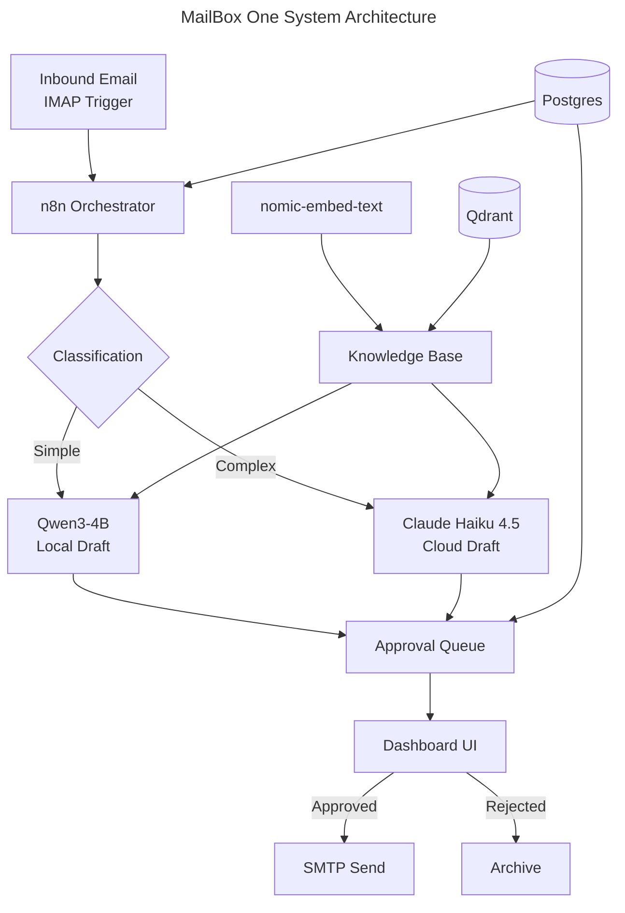

<!-- To use your own logo: replace the SVG files in assets/ or add a logo image to the <picture> sources -->
<p align="center">
  <picture>
    <source media="(prefers-color-scheme: dark)" srcset="./assets/banner-dark.svg">
    <source media="(prefers-color-scheme: light)" srcset="./assets/banner-light.svg">
    
  </picture>
</p>

<p align="center">
  <a href="LICENSE"></a>
  
  
</p>

<p align="center"><strong>A plug-and-play hardware appliance that triages, drafts, and sends email responses for small CPG brand operators — so founders stop spending 1–3 hours a day on inbox ops.</strong></p>

---

<details>
<summary>Table of Contents</summary>

- [About](#about)
- [Features](#features)
- [Architecture](#architecture)
- [Hardware Requirements](#hardware-requirements)
- [Quick Start](#quick-start)
- [Configuration](#configuration)
- [How It Works](#how-it-works)
- [Tech Stack](#tech-stack)
- [Memory Budget](#memory-budget)
- [Roadmap](#roadmap)
- [Contributing](#contributing)
- [License](#license)

</details>

## About

MailBox One is a dedicated AI email agent that runs on an NVIDIA Jetson Orin Nano Super. The customer plugs in the appliance, connects their email account, completes guided onboarding, and gets an always-on assistant that handles inbound operational email — triage, drafting, and (with human approval) sending — entirely on-device.

All email content and knowledge base data stays on the local appliance. Cloud API calls to Anthropic Claude are used only for complex drafts and escalation handling, with no bulk corpus ever leaving the device.

Sold as a managed product with white-glove onboarding and an optional support subscription.

## Features

- **On-device AI triage** — Qwen3-4B classifies and prioritizes inbound email in under 30 seconds
- **Draft generation** — local model handles routine replies; Claude Haiku 4.5 escalates for complex threads
- **Human-in-the-loop** — every outbound email requires explicit approval via the dashboard before sending
- **Privacy-first** — all email content and RAG knowledge base stored exclusively on-device
- **RAG knowledge base** — Qdrant vector search over past emails and brand context for accurate, on-brand drafts
- **Visual workflow editor** — n8n orchestrates the full email pipeline with visual debugging
- **Mobile-ready dashboard** — React-based approval queue accessible from any device on the local network

## Architecture



## Hardware Requirements

| Component | Specification |
|-----------|--------------|
| Board | NVIDIA Jetson Orin Nano Super (8GB unified VRAM) |
| Storage | 500GB NVMe SSD |
| Power | < 25W sustained under normal operation |
| Firmware | JetPack 6.2 (L4T r36.4) with Super Mode enabled |
| Network | Ethernet or Wi-Fi for email access and LAN dashboard |

## Quick Start

> [!IMPORTANT]
> Requires a Jetson Orin Nano Super flashed with JetPack 6.2. Install Docker using the [JetsonHacks script][jetsonhacks] — do not use `docker-ce` from Docker Inc., as it breaks NVIDIA runtime configuration.

```bash
# Clone the repository
git clone https://github.com/ConsultingFuture4200/mailbox.git
cd mailbox

# Copy environment template and configure
cp .env.example .env
# Edit .env with your IMAP/SMTP credentials and Anthropic API key

# Start all services
docker compose up -d
```

> [!TIP]
> After services are running, pull the AI models into Ollama:

```bash
# Pull the classification/draft model
docker compose exec ollama ollama pull qwen3:4b

# Pull the embedding model
docker compose exec ollama ollama pull nomic-embed-text:v1.5
```

The dashboard is available at `http://<APPLIANCE_IP>:3000` once all services are healthy.

<!-- TODO: Replace port 3000 with actual dashboard port once finalized -->

## Configuration

> [!IMPORTANT]
> Set all required environment variables in `.env` before first run. See `.env.example` for the full list.

| Variable | Required | Description |
|----------|----------|-------------|
| `IMAP_HOST` | Yes | IMAP server hostname |
| `IMAP_USER` | Yes | Email account username |
| `IMAP_PASSWORD` | Yes | Email account password or app-specific password |
| `SMTP_HOST` | Yes | SMTP server hostname |
| `SMTP_USER` | Yes | SMTP username (often same as IMAP) |
| `SMTP_PASSWORD` | Yes | SMTP password |
| `ANTHROPIC_API_KEY` | Yes | Pooled API key for Claude Haiku 4.5 escalation |
| `POSTGRES_PASSWORD` | Yes | Database password for the operational datastore |
| `OLLAMA_MODELS` | No | Override default model pull list |

<details>
<summary>Docker Compose services</summary>

The `docker-compose.yml` orchestrates six services:

| Service | Image | Purpose |
|---------|-------|---------|
| `ollama` | `jetson-containers` autotag | Local LLM inference with GPU passthrough |
| `qdrant` | `qdrant/qdrant:v1.17.1` | Vector database for RAG |
| `n8n` | `n8nio/n8n:latest-arm64` | Workflow orchestration (IMAP trigger → classify → draft → queue) |
| `postgres` | `postgres:17-alpine` | Operational datastore (workflows, approval queue, sent history) |
| `dashboard-api` | Custom build | Express API for approval queue and knowledge base management |
| `dashboard-ui` | Custom build | React SPA served via nginx:alpine |

</details>

## How It Works

1. **Ingest** — n8n polls the connected inbox via IMAP trigger. New emails are embedded using nomic-embed-text and stored in Qdrant alongside the raw content in Postgres.

2. **Classify** — Qwen3-4B categorizes each email (order inquiry, vendor follow-up, customer complaint, etc.) and assigns a priority level. Classification uses non-thinking mode for low latency.

3. **Draft** — Routine replies are drafted locally by Qwen3-4B using RAG context from the knowledge base. Complex or high-stakes threads are escalated to Claude Haiku 4.5 via the Anthropic API.

4. **Approve** — Every draft enters an approval queue visible in the dashboard. The operator reviews, edits if needed, and approves or rejects each response.

5. **Send** — Approved drafts are sent via SMTP through n8n. Sent history is logged in Postgres for future RAG context.

## Tech Stack


| Layer | Technology | Role |
|-------|-----------|------|
| Inference | Ollama 0.18.x + Qwen3-4B (Q4_K_M) | Local classification and draft generation (~2.7 GB VRAM) |
| Embeddings | nomic-embed-text v1.5 | RAG embedding for email and knowledge base (274 MB) |
| Escalation | Claude Haiku 4.5 (API) | Complex draft generation via Anthropic API |
| Vector DB | Qdrant 1.17.x | Semantic search over email corpus and brand context |
| Orchestration | n8n 2.14.x | Visual workflow engine with IMAP trigger and AI agent nodes |
| Datastore | PostgreSQL 17 | Approval queue, sent history, persona config, n8n state |
| Dashboard | React 18 + Vite 6 + Express 4 | Approval queue UI, knowledge base management, onboarding |
| Serving | nginx:alpine | Static file serving for the dashboard (< 10 MB, zero idle CPU) |

## Memory Budget

Total system memory on the Jetson Orin Nano Super is 8 GB unified (shared between CPU and GPU).

| Component | Footprint | Notes |
|-----------|----------|-------|
| OS + JetPack 6.2 | ~1.5 GB | Baseline with Docker daemon |
| Qwen3-4B Q4_K_M | ~2.7 GB | Stays loaded during email processing |
| nomic-embed-text v1.5 | ~350 MB | May unload between RAG operations (Ollama LRU) |
| Qdrant | ~200–400 MB | Scales with vector count; 10K emails ≈ 100 MB index |
| n8n | ~300 MB | Node.js process |
| Postgres | ~100 MB | Small operational database |
| Dashboard | ~100 MB | nginx + Express |
| **Total** | **~5.7 GB** | **~2.3 GB headroom for bursts and OS cache** |

> [!WARNING]
> Do not run 7B-parameter models locally. A 7B Q4_K_M requires ~4.5 GB VRAM, leaving insufficient memory for embeddings, Qdrant, and the OS.

## Roadmap

- [x] Core architecture and Docker Compose orchestration
- [x] Tech stack validation (Ollama + Qwen3 on Jetson)
- [ ] n8n workflow: IMAP ingest → classify → draft → approval queue
- [ ] Dashboard: approval queue with approve/reject/edit actions
- [ ] Onboarding wizard: guided email connection and persona extraction
- [ ] RAG pipeline: email embedding and knowledge base search
- [ ] OTA update delivery via GitHub Container Registry
- [ ] Multi-account support
- [ ] Fine-tuned classification model (Llama 3.2 3B base)

## Contributing

Contributions are welcome. Open an issue to discuss proposed changes before submitting a pull request.

## License

[MIT](LICENSE)

<!-- Reference-style links -->
[jetsonhacks]: https://jetsonhacks.com/2025/02/24/docker-setup-on-jetpack-6-jetson-orin/
