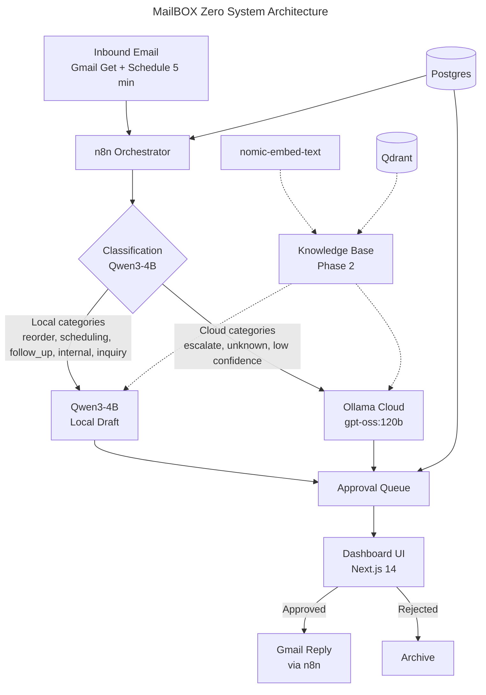

<!-- To use your own logo: replace the SVG files in assets/ or add a logo image to the <picture> sources -->
<p align="center">
  <picture>
    <source media="(prefers-color-scheme: dark)" srcset="./assets/banner-dark.svg">
    <source media="(prefers-color-scheme: light)" srcset="./assets/banner-light.svg">
    
  </picture>
</p>

<p align="center">
  <a href="LICENSE"></a>
  
  
</p>

<p align="center"><strong>A plug-and-play hardware appliance that triages, drafts, and sends email responses &mdash; so entrepreneurs running heavy inboxes stop spending hours a day on email ops.</strong></p>

---

<details>
<summary>Table of Contents</summary>

- [About](#about)
- [Who It's For](#who-its-for)
- [Features](#features)
- [Architecture](#architecture)
- [Hardware Requirements](#hardware-requirements)
- [Quick Start](#quick-start)
- [Configuration](#configuration)
- [How It Works](#how-it-works)
- [Tech Stack](#tech-stack)
- [Memory Budget](#memory-budget)
- [Roadmap](#roadmap)
- [Contributing](#contributing)
- [License](#license)

</details>

## About

MailBOX Zero is a dedicated AI email agent that runs on an NVIDIA Jetson Orin Nano Super. The customer plugs in the appliance, connects their email account, completes guided onboarding, and gets an always-on assistant that handles inbound operational email — triage, drafting, and (with human approval) sending — entirely on-device.

All email content stays on the local appliance. Cloud API calls (Ollama Cloud `gpt-oss:120b` by default; Anthropic Haiku 4.5 wired as a config-ready alternative) are made only for cloud-routed drafts — typically `escalate` / `unknown` categories or any classification with `confidence < 0.75`. No bulk corpus ever leaves the device.

Sold as a managed product with white-glove onboarding and an optional support subscription.

## Who It's For

MailBOX Zero is built for entrepreneurs whose inbox has become the bottleneck:

- **Founders** running early-stage companies where every reply still routes through them
- **Solo operators** managing multiple businesses or product lines from a single inbox
- **Agency owners and consultants** juggling client threads, proposals, and follow-ups
- **Investors and dealmakers** drowning in pitch decks, intros, and follow-up loops
- **Anyone** who has resigned themselves to "email bankruptcy" once a quarter

If you spend two or more hours a day in your inbox and the volume keeps growing, MailBOX Zero is meant for you.

## Features

- **On-device AI triage** — Qwen3-4B (4096 ctx) classifies and prioritizes inbound email in under 30 seconds
- **Two-path draft generation** — local Qwen3-4B for routine replies (`reorder`, `scheduling`, `follow_up`, `internal`, `inquiry`); Ollama Cloud `gpt-oss:120b` for `escalate` / `unknown` / low-confidence cases (Haiku 4.5 is wired as alt-cloud, swap in `.env`)
- **Human-in-the-loop** — every outbound email requires explicit approval via the dashboard before sending
- **Privacy-first** — all email content stored exclusively on-device; only cloud-routed messages briefly leave the appliance
- **Public HTTPS + auth gate** — Caddy + Cloudflare DNS-01 cert; basic_auth on `/dashboard/*` and the n8n editor
- **RAG knowledge base** *(Phase 2)* — Qdrant vector search over past emails and brand context (deployed, not yet wired)
- **Visual workflow editor** — n8n orchestrates the full pipeline; sub-workflows for classify / draft / send
- **Mobile-ready dashboard** — Next.js 14 approval queue accessible from any device, gated behind basic_auth

## Architecture



## Hardware Requirements

| Component | Specification |
|-----------|--------------|
| Board | NVIDIA Jetson Orin Nano Super (8GB unified VRAM) |
| Storage | 500GB NVMe SSD |
| Power | < 25W sustained under normal operation |
| Firmware | JetPack 6.2 (L4T r36.4) with Super Mode enabled |
| Network | Ethernet or Wi-Fi for email access and LAN dashboard |

## Quick Start

> [!IMPORTANT]
> Requires a Jetson Orin Nano Super flashed with JetPack 6.2. Install Docker using the [JetsonHacks script][jetsonhacks] — do not use `docker-ce` from Docker Inc., as it breaks NVIDIA runtime configuration.

```bash
# Clone the repository
git clone https://github.com/UMB-Advisors/mailbox.git
cd mailbox

# Copy environment template and configure
cp .env.example .env
# Edit .env: set Postgres + n8n encryption key + Cloudflare DNS token
# + Caddy basic_auth credentials + Ollama Cloud API key.
# Gmail OAuth is provisioned in n8n on first run — no IMAP/SMTP credentials needed.

# Start all services
docker compose up -d --remove-orphans
```

> [!TIP]
> After services are running, pull the AI models into Ollama:

```bash
# Pull the classification/draft model
docker compose exec ollama ollama pull qwen3:4b

# Pull the embedding model
docker compose exec ollama ollama pull nomic-embed-text:v1.5
```

The dashboard is available at `http://<APPLIANCE_IP>:3001/dashboard/queue` once all services are healthy. In the canonical deployment it sits behind Caddy at `https://mailbox.heronlabsinc.com/dashboard/queue` (TLS via Cloudflare DNS-01).

## Configuration

> [!IMPORTANT]
> Set all required environment variables in `.env` before first run. See `.env.example` for the full list. Gmail credentials are provisioned via the n8n OAuth flow on first run, not via env vars — the OAuth refresh token lives in n8n's encrypted credential store.

| Variable | Required | Description |
|----------|----------|-------------|
| `POSTGRES_PASSWORD` | Yes | Database password for the operational datastore |
| `N8N_ENCRYPTION_KEY` | Yes | Encrypts n8n's stored credentials (incl. Gmail OAuth refresh token). Generate: `openssl rand -hex 32` |
| `CLOUDFLARE_API_TOKEN` | Yes | DNS-edit-scoped token for Caddy's DNS-01 cert issuance |
| `MAILBOX_BASIC_AUTH_USER` | Yes | Caddy basic_auth username for `/dashboard/*` and the n8n editor (STAQPRO-131) |
| `MAILBOX_BASIC_AUTH_HASH` | Yes | Bcrypt hash. Generate: `docker run --rm caddy:2 caddy hash-password`. **Escape every `$` to `$$` in `.env`** — Docker Compose otherwise truncates the value |
| `OLLAMA_CLOUD_API_KEY` | Yes (for cloud-escalation drafts) | Ollama Cloud API key from `ollama.com/cloud`. Empty key disables the cloud path |
| `OLLAMA_CLOUD_MODEL` | No | Defaults to `gpt-oss:120b`; override per-deploy |
| `ANTHROPIC_API_KEY` | No | Alt-cloud fallback for drafting (Haiku 4.5). Config-ready but not the live default |

<details>
<summary>Docker Compose services</summary>

The `docker-compose.yml` orchestrates eight services:

| Service | Image | Purpose |
|---------|-------|---------|
| `postgres` | `postgres:17-alpine` | Operational datastore (`mailbox` schema) + n8n's `workflow_entity` table |
| `qdrant` | `qdrant/qdrant:v1.17.1` | Vector store (deployed; Phase 2 RAG, not yet wired) |
| `ollama` | `dustynv/ollama:0.18.4-r36.4-cu126-22.04` | Local LLM inference with GPU passthrough (Qwen3-4B + nomic-embed-text) |
| `n8n` | `n8nio/n8n:1.123.35` (pinned per DR-17) | Workflow orchestration (Schedule + Gmail Get → classify → draft → queue → Gmail Reply) |
| `caddy` | `caddy:2` | Public HTTPS via Cloudflare DNS-01; basic_auth on all paths (incl. `/webhook/*` per STAQPRO-161 — bypass removed post-DR-22) |
| `mailbox-dashboard` | Next.js 14 build | Approval queue UI + internal API routes |
| `mailbox-migrate` | Drizzle migrate runner | `docker compose --profile migrate run mailbox-migrate` |

</details>

## How It Works

1. **Ingest** — n8n's main `MailBOX` workflow runs on a 5-minute Schedule trigger and pulls new messages via the Gmail Get node (OAuth, no IMAP/SMTP). New emails land in `mailbox.inbox` (deduplicated by `gmail_message_id`). Phase 2 will additionally embed each message with nomic-embed-text and store the vector in Qdrant.
2. **Classify** — The `MailBOX-Classify` sub-workflow runs Qwen3-4B at 4096 ctx with `/no_think` for low latency, returning a category + confidence. Routes: `LOCAL_CATEGORIES` (`reorder`, `scheduling`, `follow_up`, `internal`, `inquiry`) → local; `CLOUD_CATEGORIES` (`escalate`, `unknown`) → cloud; any classification with `confidence < 0.75` → cloud safety net; `spam_marketing` → drop.
3. **Draft** — The `MailBOX-Draft` sub-workflow drafts the reply. Local route: Qwen3-4B (~2.7 GB on-device). Cloud route: Ollama Cloud `gpt-oss:120b` via the same `/api/chat` schema (Anthropic Haiku 4.5 is wired as a config-ready alt-cloud, swap in `.env`).
4. **Approve** — Every draft enters the approval queue at `https://<appliance>/dashboard/queue` (basic_auth gated). The operator reviews, edits if needed, and approves or rejects.
5. **Send** — On approve, the dashboard fires the `MailBOX-Send` sub-workflow webhook, which sends the reply via n8n's Gmail Reply node (preserving thread + references). Sent state is recorded in `mailbox.drafts.status = 'sent'`.

## Tech Stack


| Layer | Technology | Role |
|-------|-----------|------|
| Inference | Ollama 0.18.4 (Jetson autotag) + `qwen3:4b-ctx4k` | Local classification and draft generation (~2.7 GB VRAM) |
| Embeddings | nomic-embed-text v1.5 | Phase 2 RAG embedding (deployed, not yet wired) |
| Escalation | Ollama Cloud `gpt-oss:120b` (default); Anthropic Haiku 4.5 (alt-cloud, config-ready) | Cloud-route drafting via the same `/api/chat` schema |
| Vector DB | Qdrant 1.17.1 | Phase 2 semantic search over email corpus and brand context |
| Orchestration | n8n 1.123.35 (pinned per DR-17) | Visual workflow engine; sub-workflows for classify / draft / send |
| Ingress | n8n Schedule trigger (5 min) + Gmail Get (OAuth) | DR-22 KILLED Pub/Sub push 2026-04-30; polling is the live path |
| Datastore | PostgreSQL 17-alpine | Approval queue, drafts, classification results, n8n state |
| Dashboard | Next.js 14 (App Router) + Drizzle ORM | Approval queue UI + internal API routes (`mailbox-dashboard` service, per DR-24) |
| Edge | Caddy 2 + Cloudflare DNS-01 | Public HTTPS, basic_auth on `/dashboard/*` and `/` (STAQPRO-131) |

## Memory Budget

Total system memory on the Jetson Orin Nano Super is 8 GB unified (shared between CPU and GPU).

| Component | Footprint | Notes |
|-----------|----------|-------|
| OS + JetPack 6.2 | ~1.5 GB | Baseline with Docker daemon |
| Qwen3-4B Q4_K_M | ~2.7 GB | Stays loaded during email processing |
| nomic-embed-text v1.5 | ~350 MB | May unload between RAG operations (Ollama LRU) |
| Qdrant | ~200–400 MB | Scales with vector count; 10K emails ≈ 100 MB index |
| n8n | ~300 MB | Node.js process |
| Postgres | ~100 MB | Small operational database |
| Dashboard | ~150 MB | Next.js 14 (App Router) production server |
| **Total** | **~5.7 GB** | **~2.3 GB headroom for bursts and OS cache** |

> [!WARNING]
> Do not run 7B-parameter models locally. A 7B Q4_K_M requires ~4.5 GB VRAM, leaving insufficient memory for embeddings, Qdrant, and the OS.

## Roadmap

- [x] Core architecture and Docker Compose orchestration
- [x] Tech stack validation (Ollama + Qwen3 on Jetson)
- [x] n8n workflow: Gmail Get + Schedule → classify → draft → approval queue (live at customer #1 as of 2026-05-01)
- [x] Dashboard: approval queue with approve/reject/edit actions (Next.js 14, basic_auth gated)
- [x] Cloud-escalation drafting (Ollama Cloud `gpt-oss:120b`; Haiku 4.5 alt-cloud config-ready)
- [x] Public HTTPS + auth gate (Caddy + Cloudflare DNS-01, STAQPRO-131)
- [ ] **Customer #2 sign-off** — real-Gmail E2E proof + docs sync (in flight, target 2026-05-20)
- [ ] **Pre-#2 hardening** — STAQPRO-133 (smoke tests), STAQPRO-134 (CI), STAQPRO-138 (zod input validation)
- [ ] Onboarding wizard (02-08) — guided Gmail OAuth + persona extraction
- [ ] RAG pipeline: email embedding + Qdrant knowledge base search
- [ ] OTA update delivery via GitHub Container Registry
- [ ] Multi-account support
- [ ] Fine-tuned classification model (Llama 3.2 3B or Qwen3 fine-tune)

## Contributing

Contributions are welcome. Open an issue to discuss proposed changes before submitting a pull request.

## License

[MIT](LICENSE)

<!-- Reference-style links -->
[jetsonhacks]: https://jetsonhacks.com/2025/02/24/docker-setup-on-jetpack-6-jetson-ori
